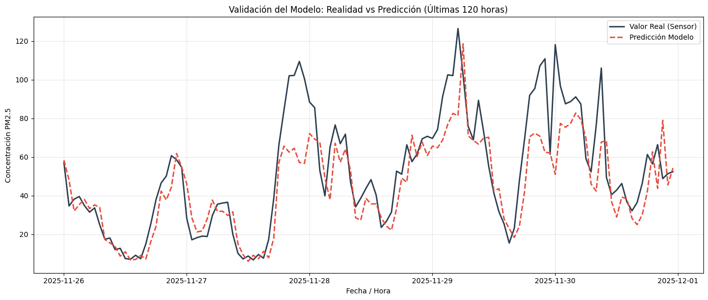

# Predicción de Calidad del Aire en Mexicali (PM2.5)

Este repositorio contiene un prototipo de **Machine Learning** desarrollado en Python para analizar y predecir la concentración de partículas PM2.5 en entornos urbanos, utilizando a la ciudad de Mexicali, B.C. como caso de estudio.

El proyecto busca demostrar cómo el uso de datos históricos de sensores públicos y algoritmos de regresión (Random Forest) puede anticipar tendencias de contaminación con una hora de antelación, sirviendo como base para sistemas de alerta temprana.

## Objetivos del Proyecto
* **Análisis de Datos Reales:** Procesamiento de series de tiempo de sensores de monitoreo ambiental.
* **Modelado Predictivo:** Entrenamiento de algoritmos para identificar patrones horarios de tráfico y actividad industrial.
* **Validación Técnica:** Comparación de métricas de desempeño (R2, MAE) frente a datos observados.

## Resultados Preliminares
El modelo fue entrenado con un dataset histórico (2022-2025) correspondiente a la zona Centro Cívico de Mexicali, obteniendo los siguientes resultados:

| Métrica | Resultado | Descripción |
| :--- | :--- | :--- |
| R2 Score | 0.75 | Coeficiente de determinación (Precisión de tendencia). |
| MAE | 8.24 | Error absoluto medio (µg/m³). |

### Visualización de Resultados

> La gráfica demuestra la capacidad del modelo para seguir la estacionalidad diaria y los picos de actividad humana.

## Stack Tecnológico
* **Lenguaje:** Python 3.10+
* **Ingeniería de Datos:** Pandas, NumPy.
* **Machine Learning:** Scikit-Learn.
* **Visualización:** Matplotlib.
* **Fuente de Datos:** Datos públicos de sensores ambientales (PurpleAir API).

## Instrucciones de Ejecución

1. Clonar el repositorio:
   ```bash
   git clone [https://github.com/lmiguelangel805-bot/mexicali-air-quality.git](https://github.com/lmiguelangel805-bot/mexicali-air-quality.git)